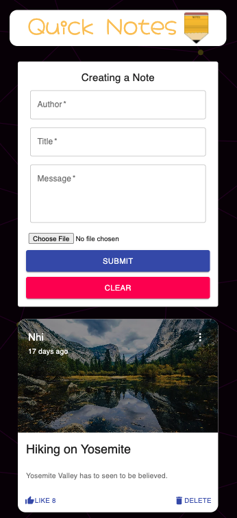
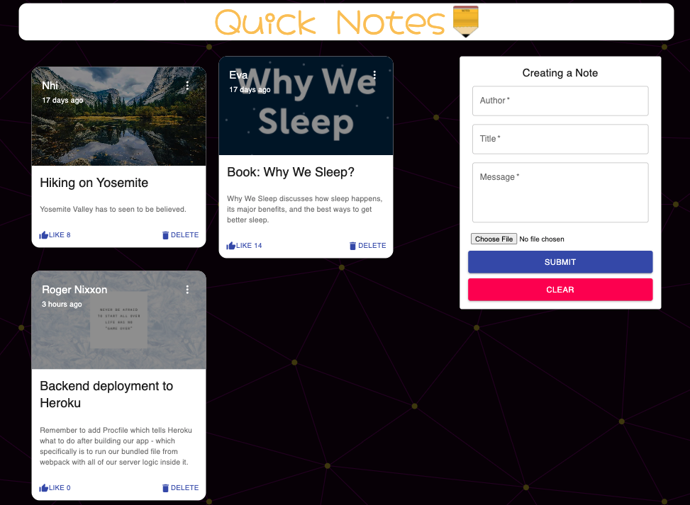

# **Quick Notes**

A full-stack note-taking and sharing application built with the MERN stack. Users can create, edit, delete, and like notes, upload images, and sign in using email/password or Google OAuth. The app is deployed on cloud platforms.

<table>
  <tr>
      <td vlign="center">
        
      </td>
      <td vlign="center">
        
      </td>
    </tr>
</table>

# **Live Demo**

- Frontend: <https://quick-notes-taking.vercel.app/>
- Backend: <https://quick-notes-taking.onrender.com/>

# **Tech**

- React, Redux, Material UI
- MongoDB
- Express, Node
- JWT Authentication

# **Features**

- User authentication (JWT + Google OAuth)
- Create, edit, delete notes
- Image upload (Base64)

# **Deployment**

- Frontend deployed on Vercel
- Backend deployed on Render
- MongoDB hosted on Atlas
