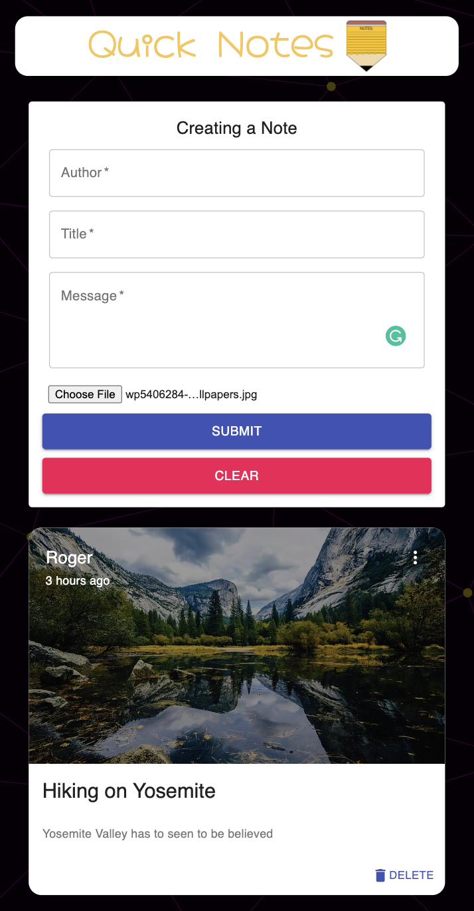
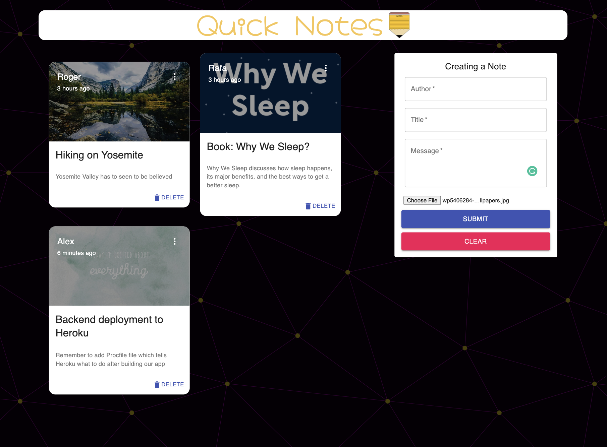

## [**Quick-Notes-Taking**](https://quick-notes-taking.netlify.app/)

### Quick-Notes is a simple social media MERN application that allows users to capture quick thoughts that they come across in order to revisit later.

<table>
  <tr>
      <td vlign="center">
        
      </td>
      <td vlign="center">
        
      </td>
    </tr>
</table>

**[See it live!](https://quick-notes-taking.netlify.app/)**

# **API**
This app works in conjunction with a backend server: https://quick-notes-taking.herokuapp.com/posts

# **Tech**
- React
- MongoDB
- Express
- Node

# **Features**
- Create/Edit/Update/Delete a note
- Upload an image from local computer
- React to a note with a like icon
